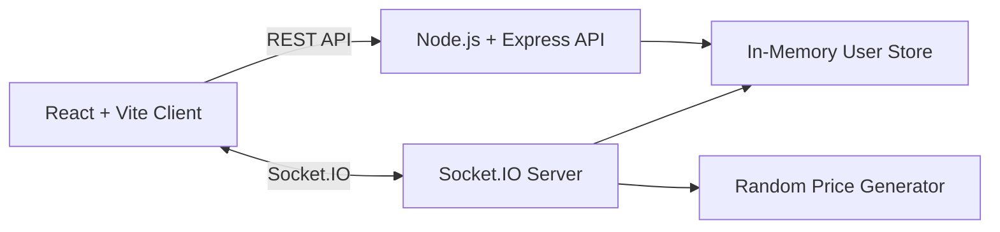
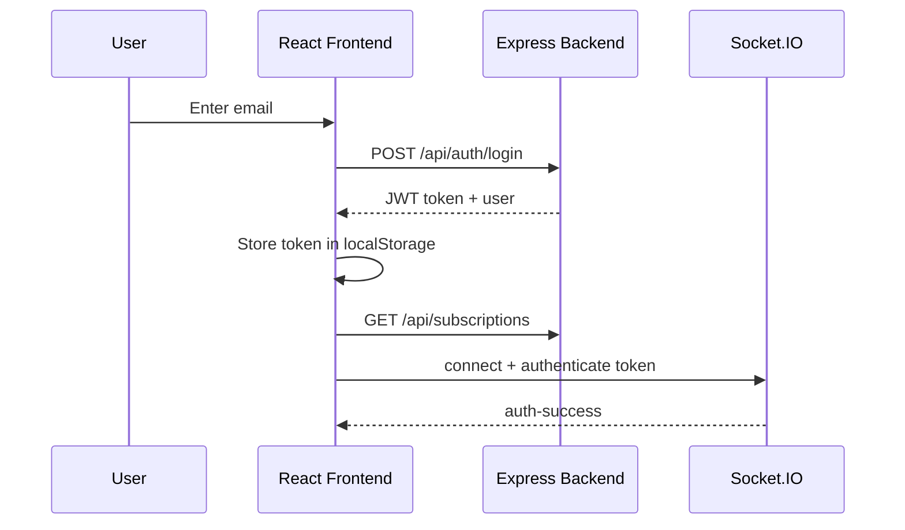
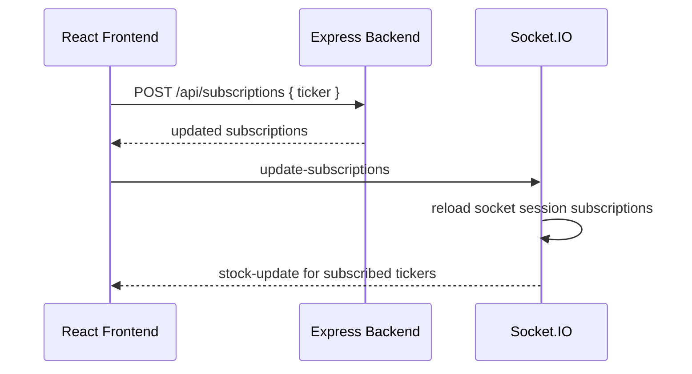

# Architecture and API Design

## Overview

This project is a full-stack stock broker client dashboard built with a React frontend and a Node.js backend.

The application uses REST APIs for login and subscription management, and Socket.IO for live stock price streaming. Prices are generated randomly every second, as required by the assignment.



## Tech Stack

Frontend:

- React.js
- TypeScript
- Vite
- Socket.IO client
- Plain responsive CSS

Backend:

- Node.js
- Express.js
- Socket.IO
- JSON Web Tokens
- In-memory user and subscription storage

## Project Structure

```text
backend/
  package.json
  src/
    index.js
    controllers/
      authController.js
      subscriptionController.js
    data/
      stocks.js
    middleware/
      auth.js
    models/
      User.js
    routes/
      authRoutes.js
      subscriptionRoutes.js
    socket/
      socketHandler.js

frontend/
  index.html
  package.json
  vite.config.ts
  tsconfig.json
  src/
    App.tsx
    api.ts
    main.tsx
    styles.css
    vite-env.d.ts
```

## Backend Design

The backend starts in `backend/src/index.js`.

Responsibilities:

- Configure Express JSON middleware.
- Configure CORS for the Vite frontend.
- Register REST routes.
- Start the HTTP server.
- Attach Socket.IO to the same HTTP server.
- Expose `/health` for quick verification.

Default backend URL:

```text
http://localhost:4000
```

## User Storage Design

Users are stored in memory in `backend/src/models/User.js`.

Each user record has:

```js
{
  id: "client@example.com",
  email: "client@example.com",
  subscriptions: ["GOOG", "TSLA"]
}
```

The app intentionally avoids MongoDB because the assignment only requires email login and demo subscriptions. Data resets when the backend restarts.

## Supported Stocks

The supported stocks are defined in `backend/src/data/stocks.js`.

```text
GOOG, TSLA, AMZN, META, NVDA
```

Initial prices are stored on the backend and then updated every second using a random price generator.

## REST API Design

### Health Check

```http
GET /health
```

Response:

```json
{
  "status": "ok",
  "supportedStocks": ["GOOG", "TSLA", "AMZN", "META", "NVDA"]
}
```

### Login

```http
POST /api/auth/login
Content-Type: application/json
```

Request:

```json
{
  "email": "client@example.com"
}
```

Response:

```json
{
  "message": "Login successful",
  "token": "jwt-token",
  "user": {
    "id": "client@example.com",
    "email": "client@example.com",
    "subscriptions": []
  }
}
```

### Register

```http
POST /api/auth/register
Content-Type: application/json
```

The register endpoint has the same request and response shape as login. It exists for compatibility, but the frontend uses email login directly.

### Get Subscriptions

```http
GET /api/subscriptions
Authorization: Bearer <token>
```

Response:

```json
{
  "subscriptions": ["GOOG"],
  "supportedStocks": ["GOOG", "TSLA", "AMZN", "META", "NVDA"]
}
```

### Subscribe

```http
POST /api/subscriptions
Authorization: Bearer <token>
Content-Type: application/json
```

Request:

```json
{
  "ticker": "GOOG"
}
```

Response:

```json
{
  "message": "Successfully subscribed to GOOG",
  "subscriptions": ["GOOG"]
}
```

### Unsubscribe

```http
DELETE /api/subscriptions/GOOG
Authorization: Bearer <token>
```

Response:

```json
{
  "message": "Successfully unsubscribed from GOOG",
  "subscriptions": []
}
```

## Socket.IO Design

The frontend connects to the backend Socket.IO server at:

```text
http://localhost:4000
```

### Client to Server Events

`authenticate`

- Payload: JWT token string.
- Purpose: Authenticates a socket connection and attaches the user's subscriptions to that socket session.

`update-subscriptions`

- Payload: none.
- Purpose: Tells the socket server to reload the user's current subscription list after a REST subscribe or unsubscribe action.

### Server to Client Events

`auth-success`

```js
{
  email: "client@example.com",
  supportedStocks: ["GOOG", "TSLA", "AMZN", "META", "NVDA"],
  subscriptions: ["GOOG"]
}
```

`auth-error`

```js
{
  error: "Invalid token"
}
```

`stock-update`

```js
{
  ticker: "GOOG",
  price: 145.22,
  timestamp: 1710000000000
}
```

## Real-Time Update Logic

Every second, the backend:

1. Updates all supported stock prices using a random percentage change.
2. Loops over connected authenticated sockets.
3. Reads each socket session's subscribed ticker set.
4. Emits `stock-update` only for that user's subscribed stocks.

This satisfies the multi-user requirement because two open dashboards can subscribe to different stocks and receive separate asynchronous update streams.

## Frontend Design

The frontend is a single React app in `frontend/src/App.tsx`.

Main responsibilities:

- Show an email login screen when no token exists.
- Store JWT token and email in `localStorage`.
- Load subscriptions after login.
- Connect to Socket.IO and authenticate the socket.
- Render subscribed stock cards with live prices.
- Render available stock buttons for quick subscription.
- Allow manual subscription by ticker code.
- Allow unsubscribe from each active stock card.

Frontend API helper functions live in `frontend/src/api.ts`.

## Frontend State

Important React state:

```ts
email: string
token: string
subscriptions: string[]
supportedStocks: string[]
prices: Record<string, StockPrice>
tickerInput: string
status: string
error: string
```

## Authentication Flow



## Subscription Flow



## Configuration

Backend environment variables:

```env
PORT=4000
CLIENT_URL=http://localhost:5173
JWT_SECRET=stock-dashboard-demo-secret
JWT_EXPIRE=7d
```

Frontend environment variable:

```env
VITE_API_URL=http://localhost:4000
```

Both apps have sensible local defaults, so `.env` files are optional for development.
