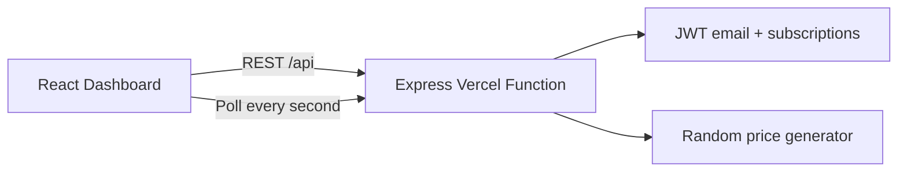

# Architecture and API Design

## Overview

The application is deployed as one Vercel project containing:

- A React/Vite static frontend.
- An Express application exposed through a Vercel Function.
- JWT-based stateless authentication and subscriptions.
- Authenticated one-second price polling.



## Deployment Structure

```text
api/
  index.js                 Vercel Function entrypoint
backend/src/
  app.js                   Express app
  index.js                 Local Node server
  controllers/             Auth, subscriptions, prices
  middleware/auth.js       JWT validation
  routes/                  Express routes
  utils/token.js           JWT creation and verification
frontend/src/
  App.tsx                  Dashboard UI and polling loop
  api.ts                   Typed REST client
vercel.json                Build, output, function, rewrite config
```

## Authentication Design

Login accepts an email and returns a JWT containing:

```json
{
  "email": "client@example.com",
  "subscriptions": []
}
```

Subscription changes return a refreshed token containing the updated ticker list. The frontend stores this token in `localStorage`.

This design avoids relying on process memory, which may disappear between serverless invocations.

## REST API

| Method | Endpoint | Authentication | Purpose |
| --- | --- | --- | --- |
| GET | `/api/health` | No | Service health and supported tickers |
| POST | `/api/auth/login` | No | Email login and JWT creation |
| POST | `/api/auth/register` | No | Login-compatible registration |
| GET | `/api/subscriptions` | Bearer JWT | Read subscriptions from JWT |
| POST | `/api/subscriptions` | Bearer JWT | Add ticker and return refreshed JWT |
| DELETE | `/api/subscriptions/:ticker` | Bearer JWT | Remove ticker and return refreshed JWT |
| GET | `/api/prices` | Bearer JWT | Return generated subscribed prices |

## Price Response

```json
{
  "prices": [
    {
      "ticker": "GOOG",
      "price": 143.12,
      "timestamp": 1781850000000
    }
  ]
}
```

The endpoint sets `Cache-Control: no-store` and only returns prices for tickers in the authenticated JWT.

## Multi-User Behavior

Each browser session owns its token. Alice can hold a token containing `GOOG`, while Bob holds a token containing `TSLA`. Their one-second requests are authenticated independently and return different ticker sets.

## Vercel Configuration

`vercel.json`:

- Runs the root build command.
- Outputs the Vite build from `frontend/dist`.
- Bundles `backend/src/**` with `api/index.js`.
- Rewrites `/api/*` requests to the Express function.

Production URL:

```text
https://stock-broker-client-assessment.vercel.app
```
